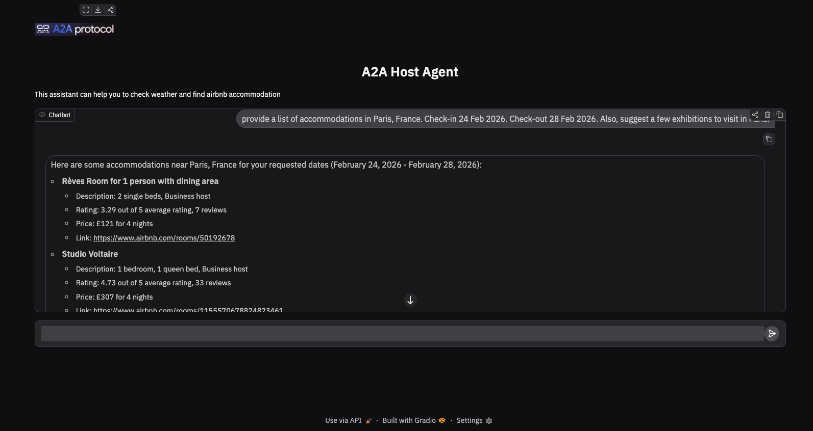

# AgenticAI-A2A for Trip-Planning
An Agentic-AI framework with ADK-A2A and MCP for trip planning. This is an agentic AI system 
capable to search for accommodation, check the weather and propose sightseeing 
in a particular destination. 


Part of the code and ideas can be found [here](https://github.com/a2aproject/a2a-samples/tree/main/samples/python/agents/airbnb_planner_multiagent). However, original code has been modified to
to make it work in scenarios where users have multiple queries, where each query can require 
access to different remote agents. The proposed Agentic AI system has been enhance with an additional agent 
that performs Google search to identify and propose venues to visit and activities to do in a country/city.





## Setup and Deployment
___

Before running the app locally, ensure you have the following:

1. Node.js: Required to run the MCP server
2. uv: The python package management tool. To create a virtual environment and 
   install all listed dependencies, run:
   ```shell
   uv install
   ```
3. python 3.13 is required to run a2a-sdk
4. set up .env
 * Create an `.env` file in airbnb_agents, weather_agents and search_agents with the following content:
 ```shell
GOOGLE_API_KEY="your_api_key_here" 
```

 * Create `.env` file in `host_agent/` folder with the following content:
 ```shell
 GOOGLE_API_KEY="your-api-key"

 GOOGLE_GENAI_MODEL="gemini-2.5-flash"
 GOOGLE_GENAI_USE_VERTEXAI=FALSE
 GOOGLE_CLOUD_LOCATION="global"
```

## 1. Run Airbnb Agent
___

```shell
cd src/airbnb_agent
uv run main.py
```


## 2. Run Weather Agent
___

```shell
cd src/weather_agent
uv run main.py
```

## 3. Run Search Agent
___

```shell
cd src/search_agent
uv run main.py
```

## 4. Run Host Agent
___

```shell
cd src/airbnb_agent
uv run main.py
```

### 5. Access and Test the agentic solution on the UI
___

```shell
http://localhost:8083/
```