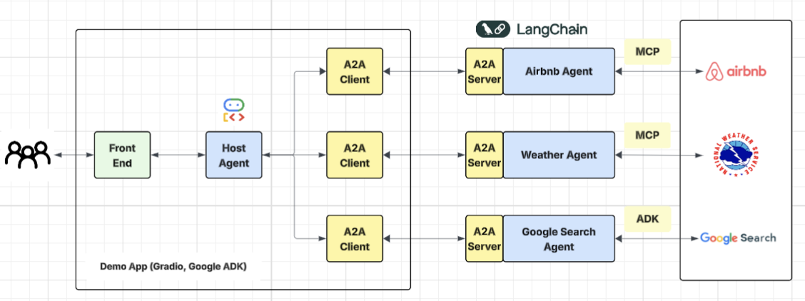

# AgenticAI-A2A-Trip-Planning
An Agentic-AI framework with ADK-A2A and MCP for trip planning. This is an agentic AI system 
capable to search for accommodation, check the weather and propose sightseeing 
in a particular destination. 

Part of the code and ideas can be found [here](https://github.com/a2aproject/a2a-samples/tree/main/samples/python/agents/airbnb_planner_multiagent). However, original code has been modified to
to make it work in scenarios where users have multiple queries, where each query can require 
access to different remote agents. The proposed Agentic AI system has been enhance with an additional agent 
that performs Google search to identify and propose venues to visit and activities to do in a country/city.

